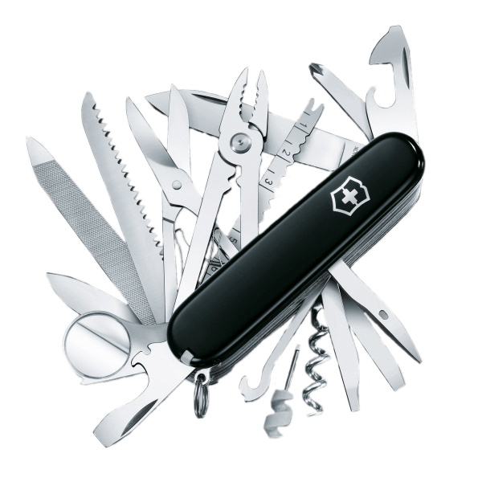

## InDesign Patterns not OutDesign Patterns
Before the Design Patterns Module, I assumed design patterns were references to designing hooking external and visual elements. Quickly I learned design patterns deal directly with internal reoccurring issues and problems. Although design pattern associates with programming, we see them all over the world. All people desire to attain or develop design patterns in their life. After all, they make life easier by providing versatile yet simplified solutions to solve multiple situations you may encounter.

## Not a Bird or a Plane or Superman, but a Design Pattern!

Easy to understand, efficient, functioning, and versatile, these are the powers of design patterns. Superman and design patterns are one and the same. However, from my interpretation, design patterns are most comparable to swiss army knives. Every software engineer should prioritize a swiss army knife implementation upon their code. Doing so creates productive and reusable code that is simple to follow, like a recipe. Although it is great to have multiple tools in your toolbox, a swiss army knife condenses what you need to carry, so the question is, why solve different issues with unique solutions when you can have a general solution to solve it all at once?

## Craving a Design Pattern
Warrior Cravings, my ICS-314 Final Project, with group members [Christine Nakano](https://cknakano.github.io/), [Jase Ishimi](https://ishimi8.github.io/), [Louie Bala](https://louie808.github.io/), and [Mahie Crabbe](https://mahi3crab.github.io/), are designing a one-stop-shop for UH students/faculty and Vendors to view and display different food available on campus. So far, there are examples of observer design patterns, such as the filter system in the Warrior Craving application, to name one. From this point on, I see myself implementing design patterns to help create better interaction from a user standpoint while also helping group members see my code as a recipe rather than a cipher.

The world is full of design patterns, and as I strive to be the best software engineer I can be, it is paramount to master them to achieve this goal. Acquiring this swiss army knife allows me to navigate many issues and pass it on to others to pick up where I left off. Whether it is the Warrior Cravings collaborative final project or a company setting, this is vital to success. Design starts on the inside, and that's what counts!