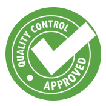

## The World Standard
Standards are a norm in the world. Everywhere you go, and the people you meet expect different standards. Without checks/rules, there is too much freedom to expect consistent quality from person to person. Standards are not going anywhere, and with the endless amount there are in the world, you need to adapt and understand them as you continue to grow.

## The Essentials: Coding Standards
In my opinion, it is paramount to have coding standards for software engineers. Every software engineer will have a unique background and ways to approach coding. With such diverse backgrounds, there are going to be differences in quality. Coding standards will create more consistent code quality amongst each software engineer.

## YESLint!

Before experiencing ESLint, the quality and readability of my prior code are not up to par with my present quality. I have found ESLint helpful to understand JavaScript by the immediate feedback it provides. Experiencing ESLint with IntelliJ, like all coding standards, takes getting used to. Code that used to be acceptable no longer passes due to the various checks ESLint goes through. Yes, it is frustrating (especially at first), but as you continue to practice, you will find you can navigate through all the errors and understand the code that warrants a green checkmark.

## Understanding The Green Checkmark

Although the green checkmark may seem trivial in the grand scheme of your life, that checkmark is always going to be there in anything you do. Every professor and job expects a certain standard of quality in your work. In most cases, you will not have a green checkmark visible to allow you to know you meet the standard. Knowing the quality of craft that merits a green checkmark is key to success. The best software engineers, students, and workers know can meet standards without needing a green checkmark/guidelines visible to tell them they did not meet the bar.

