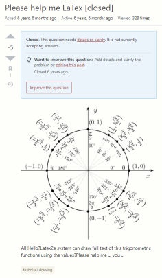

The world is full of unknowns, and the best way to uncover these unknowns is, questions, of course! From a young age, most people begin their journey to find answers. However, ultimately there are right ways to approach asking questions. The ability to ask "smart questions" is a vital tool to succeed in the world. In a field with software and technology, something new is a regular occurrence. Thus, the importance of smart questions to smart software engineers is critical. Smart software engineers navigating and asking smart questions allows unlocking more knowledge essential to their respective work. Asking smart questions will lead to learning new knowledge. Thankfully the internet and its users help catch us up to the new knowledge.

If you want to ask smart questions then all you need to do is follow the guidelines set by author Eric Raymond. To start, make sure there are no answers to your question before asking it. Secondly, where to ask your questions are important, find an appropriate setting where the level and relevance of the question match. Third, provide a concise and relevant header that outlines and hooks experts into your question. The effort of your question will often reflect your answer. Making sure the question is clear and grammatically correct, precise, and informative is necessary to smart questions. Lastly, always remember politeness will only help and never hurt you. Please(s) and thank you for your consideration(s) can go a long way and improve the likelihood of valuable answers.  

To better understand a smart question, you can look at an example [here](https://stackoverflow.com/questions/10752055/cross-origin-requests-are-only-supported-for-http-error-when-loading-a-localt). The heading ("Cross origin requests are only supported for HTTP." error when loading a local file) is to the point of the specific error and situation the user is experiencing. After the heading, the user provides background information, category tags, error prompt, and what they are trying to accomplish. In the end, the question follows many qualifications set for smart questions, and in turn, it got many answers. Although the question could still improve, this delivers a concrete example of a smart question.

On the other side of the spectrum, we will examine a [bad question example](https://tex.stackexchange.com/questions/255496/please-help-me-latex) that does not follow the smart question guidelines. Starting with the heading (Please help me LaTex), this is more likely to warrant experts ignoring and moving on than answering your question since it is not professional. In addition to this, the header also does not help clarify the problem whatsoever. Saying "Please help me LaTex" within a LaTex community is way too generic. Lastly, the content of the question is grammatically poor (All Hello?Latex2e system can draw full text of this trigonometric functions using the values?Please help me ... you ...). None of it makes any sense, and from the perspective of an expert trying to answer the question, why would they spend the effort answering if you cannot properly ask the question. Even by answering the question, there is no definitive way to know this is the solution the user seeks. All these elements together sum up a bad question.

Often, a public space, whether in-person or, online can be a daunting place to ask questions. However, reading Eric Raymond's ["How To Ask Questions The Smart Way"] (http://www.catb.org/esr/faqs/smart-questions.html) gives you a handy guide of the dos and don'ts and insight into asking smart questions. Knowing the difference between questions and smart questions can help you advance beyond the novice/surface level where we start when we are young.
